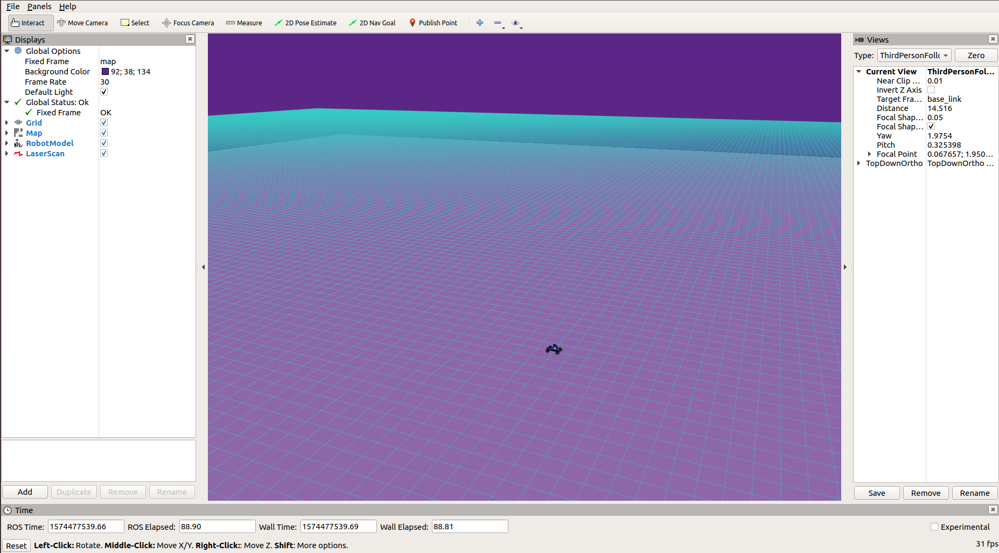

# Project 1: Introduction 

1. In ROS, a node is any executable file. A node can be a publisher or a subscriber. A publisher node sends information, or a topic, to the subscriber node which is listening for the topic.
2. A launch file can launch multiple ROS nodes at once and set up parameters.
3. 
4. 
5. 

